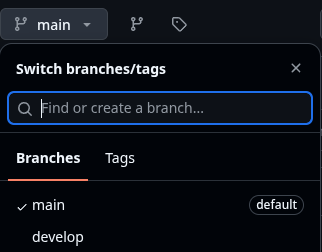
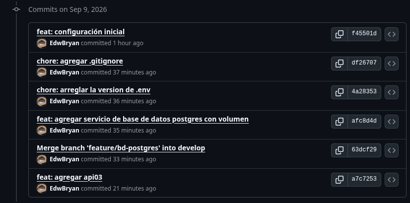
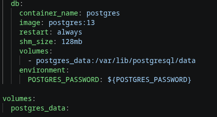
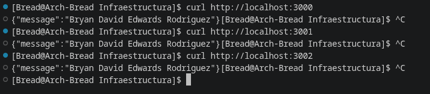
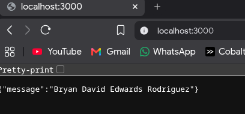
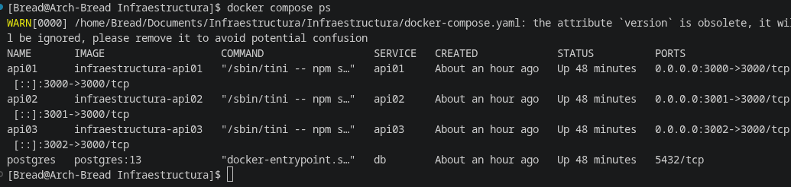
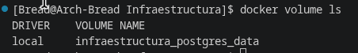

# Laboratorio 02

## Actividad
Trabajar en un docker compose, especificando configuración y comandos para despliegue.

Debe permitir lo siguiente:
- Hacer uso de conventional commits
- Repositorio publico
- 3 copias de una API build local
- Uso de variables de entorno
- Configuración BD
- Uso de volumenes
- Usar .gitignore (.env)
- Opcional: Screenshots

## 1. Hacer uso de conventional commits

Utilizando la herramienta **git flow**, hice commits siguiendo la guia:

### Branch separado del main

### Commits


## 2. El repositorio es publico


## 3. 3 copias de una API build local
```
services:
  api01:
    container_name: api01
    build: ./api
    ports:
      - "3000:3000"
    environment:
      MESSAGE: ${NOMBRE}

  api02:
    container_name: api02
    build: ./api
    ports:
      - "3001:3000"
    environment:
      MESSAGE: ${NOMBRE}

  api03:
    container_name: api03
    build: ./api
    ports:
      - "3002:3000"
    environment:
      MESSAGE: ${NOMBRE}
```

## 4. Uso de variables de entorno
Se utilizo el archivo .env para utilizar como variable el nombre y esconder la contaseña de la base de datos.
```
 volumes:
      - postgres_data:/var/lib/postgresql/data
    environment:
      POSTGRES_PASSWORD: ${POSTGRES_PASSWORD}   # variable de entorno
```

```
    environment:
      MESSAGE: ${NOMBRE}
```

## 5. Configuración de la base de datos
Se configuro la base de datos postgre para docker:

- **El nombre:**
```container_name: postgres```
- **La imagen:** Docker descarga esa imagen si no la tienes localmente desde DockerHub, y su version es la 13.
```image: postgres:13```

- **Reinicio automático:** si se detiene o si Docker se reinicia.
```restart: always```
- **Memoria compartida**: asigna 128MB de memoria compartida al contenedor, un valor comun y pequeño de memoria.
- **Contraseña**: Mediante variable de entorno
```
environment:
  POSTGRES_PASSWORD: ${POSTGRES_PASSWORD}
  ```
- **Volumen persistente:**
```
volumes:
  - postgres_data:/var/lib/postgresql/data
```

## 6. Uso de volumenes:
Conecta el volumen **postgres_data** con la carpeta donde PostgreSQL guarda sus datos. Con esto se puede conservar la información aunque el contenedor se detenga o se elimine.



La sección de volúmenes no perdera los datos, mientras no se elimine manualmente postgres_data.

## 7. Usar .gitignore
Para no dejar publicas las variables de entorno, se creo el archivo .gitignore y se agrego .env


# Como correr esta instancia

## 1. Crear el archivo .env
En el asigna las variables de entorno para tu nombre y la contraseña de postgreSQL:

**.env**
```
NOMBRE = Bryan David Edwards Rodriguez
POSTGRES_PASSWORD = EJEMPLO_CONTRASEÑA
```

## 2. Construir e iniciar los contenedores
Este comando los construye e inicia a las 3 APIs y a postgre.

```
docker compose up --build
```
Y si deseas que se ejecute en segundo plano, basta con un flag **-d**
```
docker compose up --build -d
```

## 3. Probar las APIs
Estas deben devolver como respuesta lo que pusiste en tu variable de entorno, el mensaje.

**{"message":"Tu Nombre"}**

Cuando lo corres de manera local puedes llamarlo con un curl, o en un navegador:
```
curl http://localhost:3000
curl http://localhost:3001
curl http://localhost:3002
```
#### Curl

#### Navegador


## 4. Comprobaciones
### a. Comprobar estado de los servicios
Los servicios api01, api02, api03 y postgres deben aparecer como Up.

```docker compose ps```


### b. Comprobar el volumen de PostgreSQL

```docker volume ls```

Debe aparecer un volumen similar a: **infraestructura_postgres_data**



## 5. Detener los servicios

Este comando para y elimina los contenedores, pero conserva el volumen de PostgreSQL(postgres_data).

```docker compose down```

# Preguntas
## Tipos de redes en Docker

Docker permite utilizar diferentes tipos de redes(Controladores de red):

- **bridge:** red predeterminada para conectar contenedores dentro del mismo equipo.
- **host:** el contenedor utiliza directamente la red del equipo anfitrión.
- **none:** el contenedor no tiene conexión a red.
- **overlay:** conecta contenedores ubicados en diferentes hosts Docker, normalmente usando Docker Swarm.
- **macvlan:** asigna al contenedor una dirección MAC propia dentro de la red física.

En este proyecto Docker Compose crea automáticamente una red de tipo bridge. Por esto, los servicios pueden comunicarse entre sí usando sus nombres de servicio, como api01, api02, api03 y db.

## Tipos de volúmenes y montajes en Docker

Son formas de almacenamitno o montaje

Docker permite almacenar información de distintas formas:

- **Volumen nombrado:** Docker administra su ubicación y permite conservar los datos aunque se elimine el contenedor.
- **Bind mount:** conecta directamente una carpeta o archivo del equipo anfitrión con una ruta dentro del contenedor.
- **tmpfs:** almacena los datos temporalmente en la memoria RAM; la información se pierde cuando se elimina el contenedor.

Este proyecto utiliza un volumen nombrado llamado `postgres_data`:

```
volumes:
  - postgres_data:/var/lib/postgresql/data
```

La linea del final del volumen permite que Docker lo administre:
```
volumes:
  postgres_data:
``` 